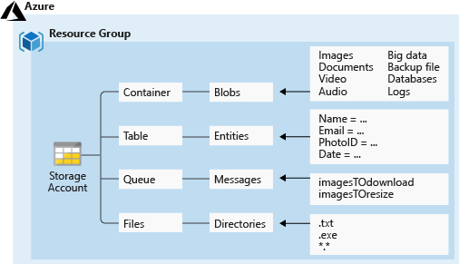

Azure Storage
- provides a file system service for the cloud, a messaging store for reliable messaging, and a NoSQL store.
- for working data, for Developers
   - Working data includes websites, mobile apps, and desktop applications
- for 3 categories of data
  - structured data
    - Azure Table Storage: Tables are an autoscaling NoSQL store.
    - by DB: SQL Database, Cosmos DB
  - unstructured data: stored by Azure Blob Storage and Azure Data Lake Storage
  - virtual machine data
    - Azure managed disks: persistent block storage
      - including OS Disk, Data Disk, snapshoot 
    - Azure Files

# Storage Account

**Security + networking** > **Access keys**
- 永远只有 两个 key, `key1`, `key2` 
  - cannot be renamed 
  - you can only `Rotate key` 
  - much faster than using Entra identity credential to authN.

## Azure Blob Storage
- aka. blobs
- protocols support: NFS 3.0 and HTTP
  - Windows client for NFS isn't supported yet. Linux is supported
- Blob data in Azure Blob Storage is accessed through a container.
- Change feed: the audit log on data and metadata
  - stored as avro format, in container `$blobchangefeed`
  - pre-requisite for Object Replication and blob Point-in-time restore
commands 
- `Azcopy copy <source> https://<domain>.blob.core.windows.net/public -recursive` for upload folder
  
- `Set-AzStorageBlobContent` to upload single file

## Azure Files
- aka. file shares
- protocols support: SMB, NFS, HTTP
- client device OS support: Windows, Linux, macOS  
- support use Azure Backup to back up file shares.
- support **Windows File Explorer**(资源管理器)
  - You can create Azure file share snapshots that integrate with the Previous Versions feature in 资源管理器.
- Replicate file shares to **Windows Servers** by using Azure File Sync
  - You can replicate on-premises or in the cloud for performance and distributed caching of the data where it's being used.
- can be configured to use Microsoft Entra Kerberos to provide identity-based access to data storage.

commands
- `Azcopy copy`

